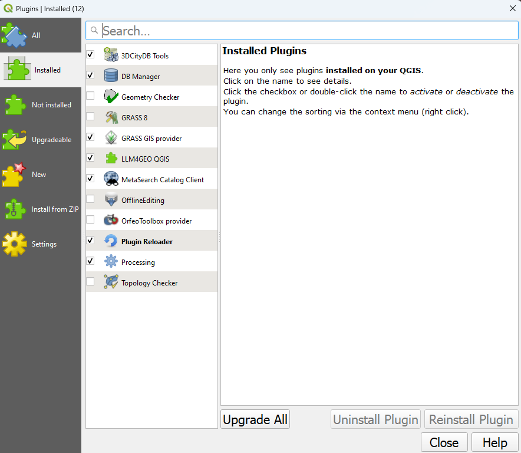
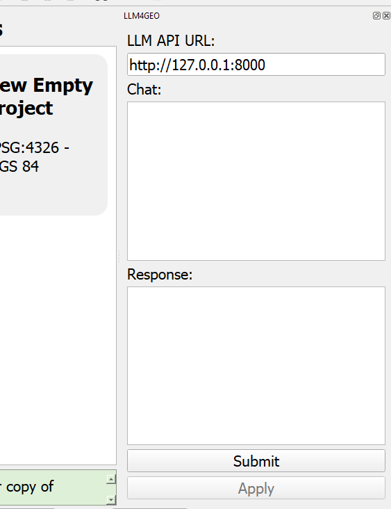

## Large Language Models for Geospatial (LLM4Geo)

An api based utility to convert prompts into geospatial related functions.

## NOTE: In its current form this application sends a description of your workspace to the remote model so that it can choose things. 
## Don't use with sensitive information.

### Getting Started

Docker stuff not setup yet, ignore that.  Eventually postgis and vector embeddings...  

Install the dependencies (preferably in a virtual environment or using conda)
 ```bash
  python -m venv 
  venv source venv/bin/activate
  pip install -r requirements.txt
  ```
OR  (I like this because it will also install QGIS which is helpful for resolving QGIS dependencies and developing QGIS plugin)
```bash
conda env create
conda activate llm4geo
```

Run the API using the dev server, `python manage.py runserver`

Copy the qllm4geo folder into your QGIS plugin directory. 
For example on windows C:\Users\<you>\AppData\Roaming\QGIS\QGIS3\profiles\default\python\plugins..
on linux you can do `ln -s <repo_root>/plugins/qllm4geo ~/.local/share/QGIS/QGIS3/profiles/default/python/plugins/`
the result should have a qllm4geo folder in the plugins directory. 
### Getting Started

Install the dependencies (preferably in a virtual environment.)
Copy the qllm4geo folder into your QGIS plugin directory. 
For example on windows C:\Users\<you>\AppData\Roaming\QGIS\QGIS3\profiles\default\python\plugins..
the result should have a qllm4geo folder in the plugins directory.

When you start QGIS you should see qllm4geo in your plugins (you may need to enable it).

When enabled you should see the widget in your workspace.


Thanks to Shane Brennan for his work on CartoBot which inspired this project.
